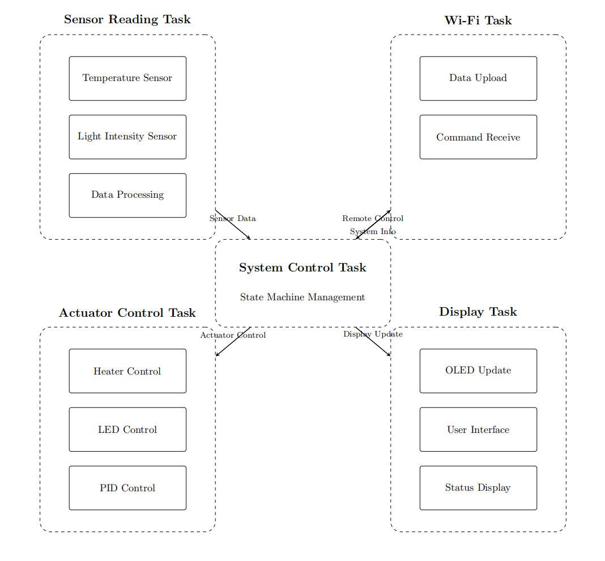
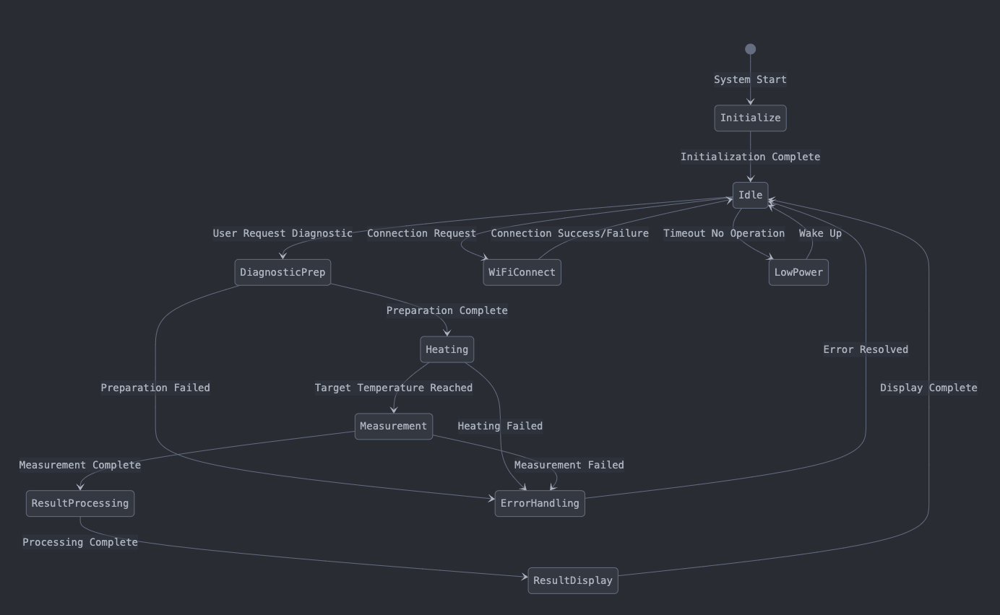
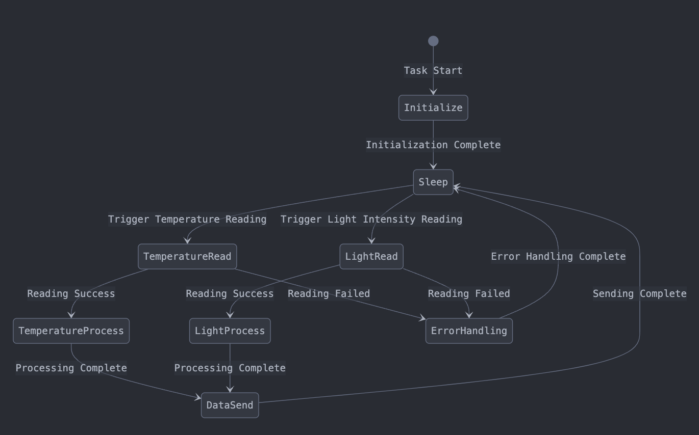
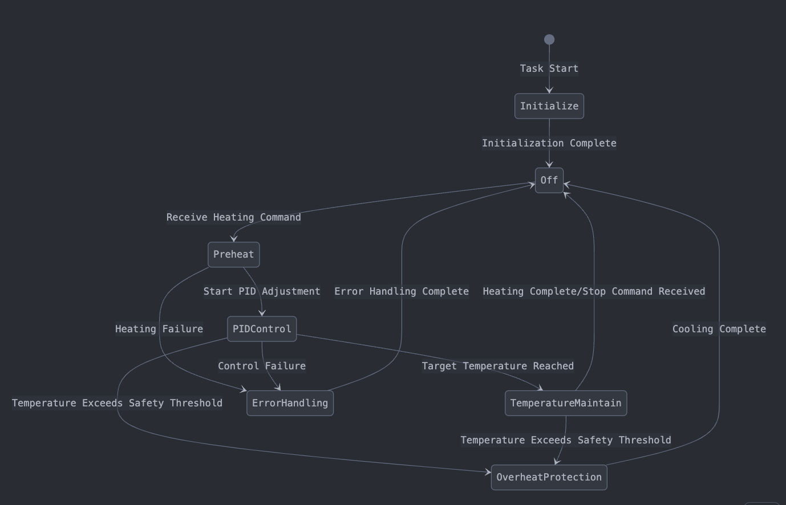
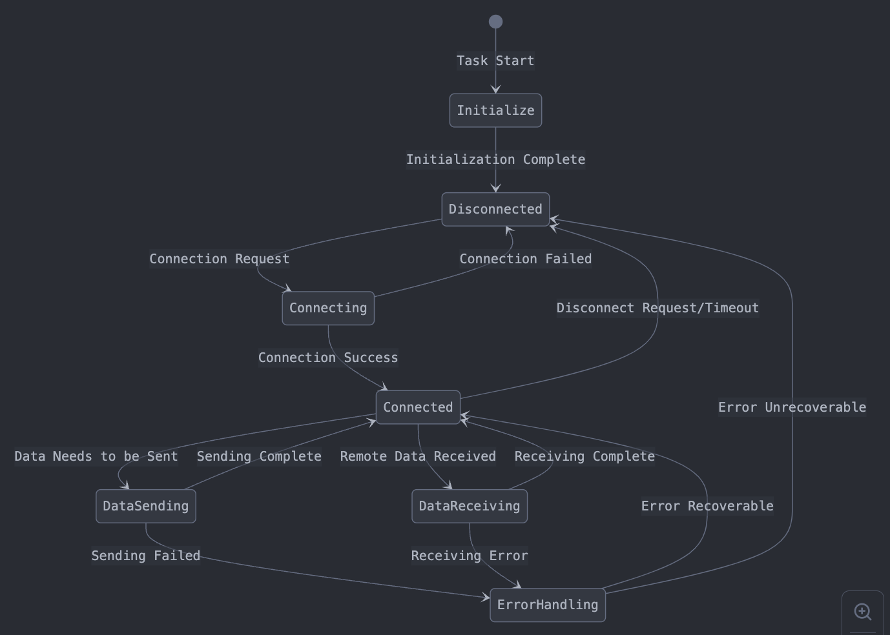

# a07g-exploring-the-CLI

* Team Number: T16 
* Team Name: Slap Queen
* Team Members: Tianle Chen & Sitong Li
* GitHub Repository URL: https://github.com/ese5160/final-project-a07g-a14g-t16-slap-queen.git
* Description of test hardware: (development boards, sensors, actuators, laptop + OS, etc)

## 1. Updated Hardware and Software Requirements Specification (HRS & SRS)

### Hardware Requirements Specification (HRS)
- **Main Controller**: ATSAMW25H18-MR210PB1952 MCU and Wi-Fi module
- **Sensor System**:
   - MAX31855JASA+ temperature sensor, connected via SPI interface
   - VEML7700-TR light intensity sensor, connected via I2C interface
- **Actuators**:
   - COM-11288 heating pad, controlled via PWM
   - BL-HBXJXGX32L blue LED, controlled via PWM
- **Display System**: Adafruit 326 OLED monitor, connected via I2C interface
- **Power System**:
   - BQ24075 power management IC, supporting USB (5V/1.5A) and Li-Ion battery (3.7V/2200mAh) dual input
   - TPS631010 Buck-Boost converter, providing 5V/825mA power to the heating pad
   - TPS628438DRL Buck converter, providing 3.3V/167mA power to MCU and peripherals

### Software Requirements Specification (SRS)
- **System Control Task**:
   - Responsible for overall system coordination and operation mode control
   - Handles user interface logic and system state management
   - Implements state machine control of the diagnostic process
- **Sensor Task**:
   - Temperature sensor data acquisition and processing (SPI interface)
   - Light intensity sensor data acquisition and processing (I2C interface)
   - Sensor data filtering and anomaly detection
- **Heating Control Task**:
   - PWM control of heating pad temperature
   - Implementation of PID temperature control algorithm
   - Heating safety protection mechanism
- **Display Task**:
   - OLED display interface updates
   - System status and measurement results display
   - User prompt information display
- **Wi-Fi Communication Task**:
   - Establishing connection with remote server
   - Transmission of diagnostic data
   - Receiving remote control commands

## 2. Software Task Block Diagram

## 3. Task State Machine Diagrams

### System Control Task State Machine

### Sensor Task State Machine

### Heater Control Task State Machine

### Wi-Fi Communication Task State Machine

