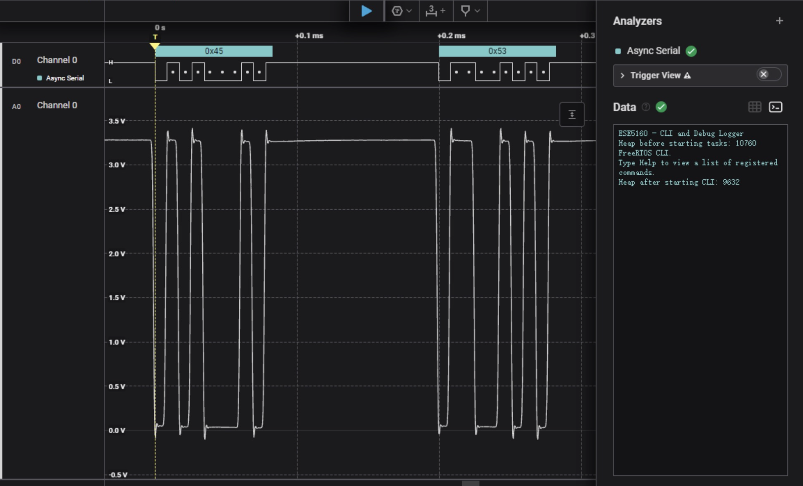

# a07g-exploring-the-CLI

* Team Number: T16
* Team Name: Slap Queen
* Team Members: Tianle Chen & Sitong Li
* GitHub Repository URL: https://github.com/ese5160/final-project-a07g-a14g-t16-slap-queen.git
* Description of test hardware: (development boards, sensors, actuators, laptop + OS, etc)

## 1. Updated Hardware and Software Requirements Specification (HRS & SRS)

### Hardware Requirements Specification (HRS)

- **Main Controller**: ATSAMW25H18-MR210PB1952 MCU and Wi-Fi module
- **Sensor System**:
  - MAX31855JASA+ temperature sensor, connected via SPI interface
  - VEML7700-TR light intensity sensor, connected via I2C interface
- **Actuators**:
  - COM-11288 heating pad, controlled via PWM
  - BL-HBXJXGX32L blue LED, controlled via PWM
- **Display System**: Adafruit 326 OLED monitor, connected via I2C interface
- **Power System**:
  - BQ24075 power management IC, supporting USB (5V/1.5A) and Li-Ion battery (3.7V/2200mAh) dual input
  - TPS631010 Buck-Boost converter, providing 5V/825mA power to the heating pad
  - TPS628438DRL Buck converter, providing 3.3V/167mA power to MCU and peripherals

### Software Requirements Specification (SRS)

- **System Control Task**:
  - Responsible for overall system coordination and operation mode control
  - Handles user interface logic and system state management
  - Implements state machine control of the diagnostic process
- **Sensor Task**:
  - Temperature sensor data acquisition and processing (SPI interface)
  - Light intensity sensor data acquisition and processing (I2C interface)
  - Sensor data filtering and anomaly detection
- **Heating Control Task**:
  - PWM control of heating pad temperature
  - Implementation of PID temperature control algorithm
  - Heating safety protection mechanism
- **Display Task**:
  - OLED display interface updates
  - System status and measurement results display
  - User prompt information display
- **Wi-Fi Communication Task**:
  - Establishing connection with remote server
  - Transmission of diagnostic data
  - Receiving remote control commands

### Software Task Block Diagram


### Task State Machine Diagrams

#### System Control Task State Machine


#### Sensor Task State Machine


#### Heater Control Task State Machine


#### Wi-Fi Communication Task State Machine


## 2. Understanding the Starter Code

### Question 1: InitializeSerialConsole() Function

The `InitializeSerialConsole()` function is responsible for initializing UART communication and associated ring buffers. Specifically, it:

- Initializes receive (RX) and transmit (TX) ring buffers
- Configures UART (SERCOM4) parameters, setting it to 115200 baud, 8 data bits, no parity, 1 stop bit (8N1)
- Registers UART read and write callback functions
- Begins the first read operation, starting the continuous character reading process

`cbufRx` and `cbufTx` are ring buffer handles of type `cbuf_handle_t`, which is essentially a pointer to a `circular_buf_t` structure. The `circular_buf_t` is a structure type defined in the `circular_buffer.c` file.

### Question 2: Circular Buffer Initialization

`cbufRx` and `cbufTx` are initialized using the following code:

```c
cbufRx = circular_buf_init((uint8_t *)rxCharacterBuffer, RX_BUFFER_SIZE);
cbufTx = circular_buf_init((uint8_t *)txCharacterBuffer, TX_BUFFER_SIZE);
```

The ring buffer-related functions and data structures come from the following files:

- `circular_buffer.h` - Defines the ring buffer API interface
- `circular_buffer.c` - Implements the specific functionality of the ring buffer

The `circular_buffer.c` file defines the `circular_buf_t` structure:

```c
struct circular_buf_t {
    uint8_t * buffer;
    size_t head;
    size_t tail;
    size_t max; //of the buffer
    bool full;
};
```

### Question 3: Character Storage Arrays

RX and TX characters are stored in the following global arrays:

```c
char rxCharacterBuffer[RX_BUFFER_SIZE]; // For storing received characters
char txCharacterBuffer[TX_BUFFER_SIZE]; // For storing characters to be sent
```

The size of both arrays is determined by defined constants:

```c
#define RX_BUFFER_SIZE 512 // Receive buffer size is 512 bytes
#define TX_BUFFER_SIZE 512 // Transmit buffer size is 512 bytes
```

These buffers are the base storage areas for the ring buffers, and the buffer pointers in the `cbufRx` and `cbufTx` ring buffer structures point to these arrays.

### Question 4: UART Interrupt Definitions

UART interrupts are handled through callback functions, which are defined in the `SerialConsole.c` file:

```c
void usart_read_callback(struct usart_module *const usart_module); // Read complete callback
void usart_write_callback(struct usart_module *const usart_module); // Write complete callback
```

These callback functions are registered in the `configure_usart_callbacks()` function:

```c
static void configure_usart_callbacks(void)
{
    usart_register_callback(&usart_instance,
                           usart_write_callback,
                           USART_CALLBACK_BUFFER_TRANSMITTED);
    usart_register_callback(&usart_instance,
                           usart_read_callback,
                           USART_CALLBACK_BUFFER_RECEIVED);
    usart_enable_callback(&usart_instance, USART_CALLBACK_BUFFER_TRANSMITTED);
    usart_enable_callback(&usart_instance, USART_CALLBACK_BUFFER_RECEIVED);
}
```

### Question 5: UART Callback Functions

#### a. A character is received? (RX)

When a character is received, the `usart_read_callback` function is called. This function is marked in the code as "ToDo: Complete this function", and should be implemented to place the received character into the `cbufRx` ring buffer.

#### b. A character has been sent? (TX)

When a character has been sent, the `usart_write_callback` function is called. This function is already implemented and checks if `cbufTx` has more characters to send; if so, it continues sending the next character.

### Question 6: Callback Function Operations

The relationship between callbacks and ring buffers is as follows:

For receiving characters (RX):

- When a character is received via UART, it triggers `usart_read_callback`
- This callback should store the received character in the `cbufRx` ring buffer
- Then it should start the next character read to continuously receive characters

For sending characters (TX):

- When characters need to be sent, they are first added to the `cbufTx` ring buffer (via the `SerialConsoleWriteString` function)
- If the UART transmitter is idle, a character is extracted from the buffer and transmission begins
- When the character transmission is complete, it triggers `usart_write_callback`
- This callback checks if the buffer has more characters; if so, it continues sending the next character, forming a chain of continuous transmission

### Question 7: UART Receive Flow

Program flow for UART receive:

```
User types a character in terminal
    |
    v
UART hardware receives character
    |
    v
Interrupt triggers, calls usart_read_callback
    |
    v
Received character (latestRx) is added to cbufRx ring buffer
    |
    v
Start next UART read operation
    |
    v
Application retrieves character from cbufRx using SerialConsoleReadCharacter function
```

Key function calls:

- During initialization: `usart_read_buffer_job(&usart_instance, (uint8_t *)&latestRx, 1);` starts the first read
- In the callback, latestRx should be added to cbufRx, then `usart_read_buffer_job` should be called again to continue reading
- SerialConsoleReadCharacter uses `circular_buf_get(cbufRx, (uint8_t *)rxChar)` to retrieve characters from the ring buffer

### Question 8: UART Transmit Flow

Program flow for UART transmission:

```
Application calls SerialConsoleWriteString
    |
    v
Each character in the string is added to cbufTx ring buffer
    |
    v
If UART transmitter is idle, extract a character (latestTx) from cbufTx and begin transmission
    |
    v
UART hardware sends character
    |
    v
Transmission complete, interrupt triggers, calls usart_write_callback
    |
    v
Extract next character from cbufTx (if available) and continue transmission
    |
    v
Character is displayed on terminal
```

Key function calls:

- In SerialConsoleWriteString: `circular_buf_put(cbufTx, string[iter]);` adds characters to the buffer
- If UART is idle: `circular_buf_get(cbufTx, (uint8_t *)&latestTx);` and `usart_write_buffer_job(&usart_instance, (uint8_t *)&latestTx, 1);` start transmission
- In the callback: the above two operations are performed again to continue sending the next character

### Question 9: startTasks() Function

The `StartTasks()` function is used to initialize various tasks (threads) in the system. According to the provided code, this function:

1. Prints the current heap space size
2. Creates the Command Line Interface (CLI) task
3. Prints the heap space size again after creating the CLI task

From the code, it's evident that only one thread is created:

```c
if (xTaskCreate(vCommandConsoleTask, "CLI_TASK", CLI_TASK_SIZE, NULL, CLI_PRIORITY, &cliTaskHandle) != pdPASS)
{
    SerialConsoleWriteString("ERR: CLI task could not be initialized!\r\n");
}
```

This thread is the CLI task (Command Line Interface), responsible for handling commands input by users through the serial terminal.

In summary, the `StartTasks()` function creates 1 thread, which is the CLI task thread.

## 3.Debug Logger Module

- Uploaded in the files

## 4. Wiretap the convo

### 1. What nets must you attach the logic analyzer to?
- Looking at how the firmware sets up the UART in SerialConsole.c, I need to connect to the UART TX and RX signal lines. These signal lines transmit serial data between the SAMW25 and the EDBG IC. According to the UART protocol, I need to connect at minimum:

- TX (transmit data line)
- RX (receive data line)
- GND (ground line as reference)

### 2. Where on the circuit board can you attach / solder to?
I can connect the logic analyzer at:

- Test points along the UART communication lines between the SAMW25 and EDBG IC
- Any exposed pads for the UART pins on the board
- Direct connection to test pins or debug headers if available
- Reference the Altium project files for the SAMW25 Xplained dev board to locate the specific UART pin locations

### 3. What are critical settings for the logic analyzer?
Critical settings for the Saleae Logic 8 when decoding UART include:

- Baud rate: Must match the UART baud rate set in the firmware (typically 9600, 115200, etc.)
- Data bits: Typically 8 bits
- Stop bits: Typically 1 bit
- Parity: Based on firmware settings (typically none)
- Trigger settings: Can be configured to trigger on the start of data transmission
- Sampling rate: At least 4x the baud rate to ensure accurate signal capture

- I also need to add the UART analyzer in the Saleae Logic software and configure appropriate capture modes to monitor the complete communication process.



## 5.Complete the CLI

- Uploaded in the files

## 6. Add CLI commands

Youtube Link: https://youtube.com/shorts/5Ef5rhe56YE
